[English](README.md)

# Pico-PAL-Test-Card-Generator

Хардуерен генератор на PAL тестов сигнал (625 реда, 50 Hz, презредова развивка), изграден около микроконтролер **YD-RP2040** (клонинг на оригиналния Raspberry Pi Pico RP2040 с USB Type-C интерфейс). Генерира композитен видеосигнал чрез RCA (чинч) конектор, включително цифрово синтезиран PAL цветен подносител, както и тестов тон от 1 kHz през втори RCA конектор. С един бутон могат да се избират осем тестови таблици, сред които **Philips PM5544**, **Telefunken FuBK**, **Grundig VG1001** (българският вариант, използван от БНТ/Nova TV) и руската карта **UEIT**.

Не се използва видеочип. RP2040 извежда 8-битови семпли директно от RAM чрез PIO и DMA с честота четири пъти честотата на цветната подносеща вълна при PAL стандарт  (4 × fsc), към ЦАП (цифрово-аналогов преобразувател) с резисторна стълбица. Всичко — включително синхронизацията, цветният burst и цветоносещата информация — се изчислява програмно.

## Характеристики

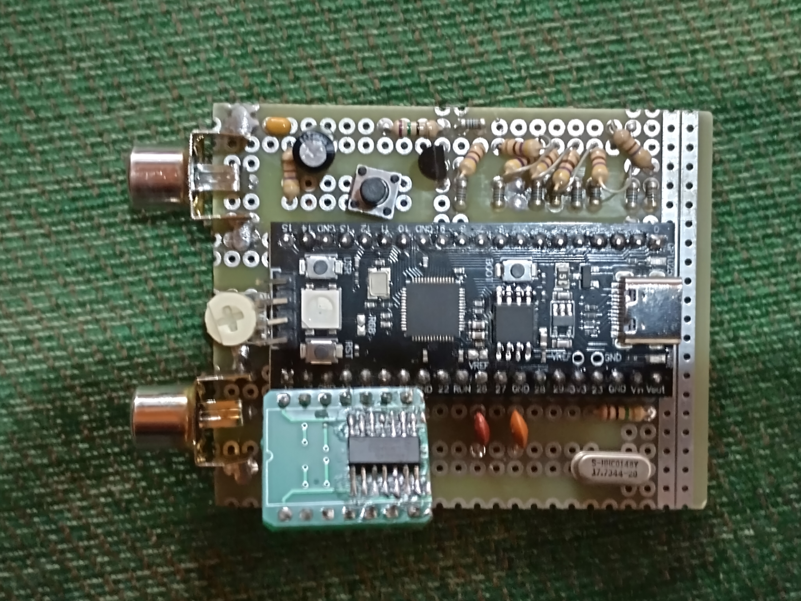
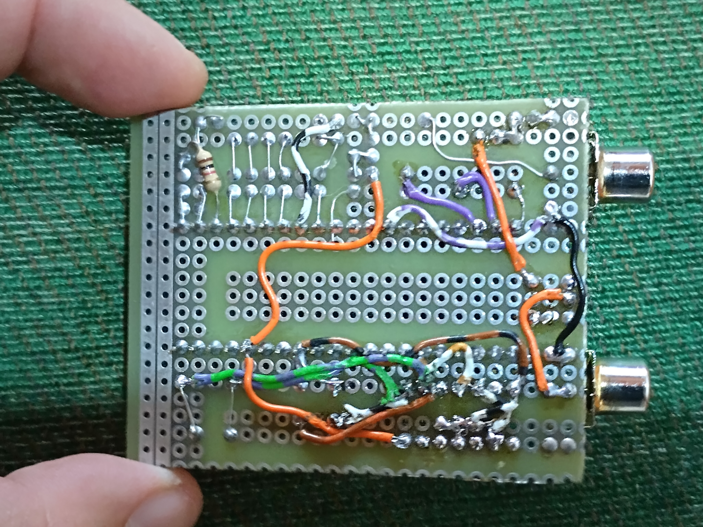
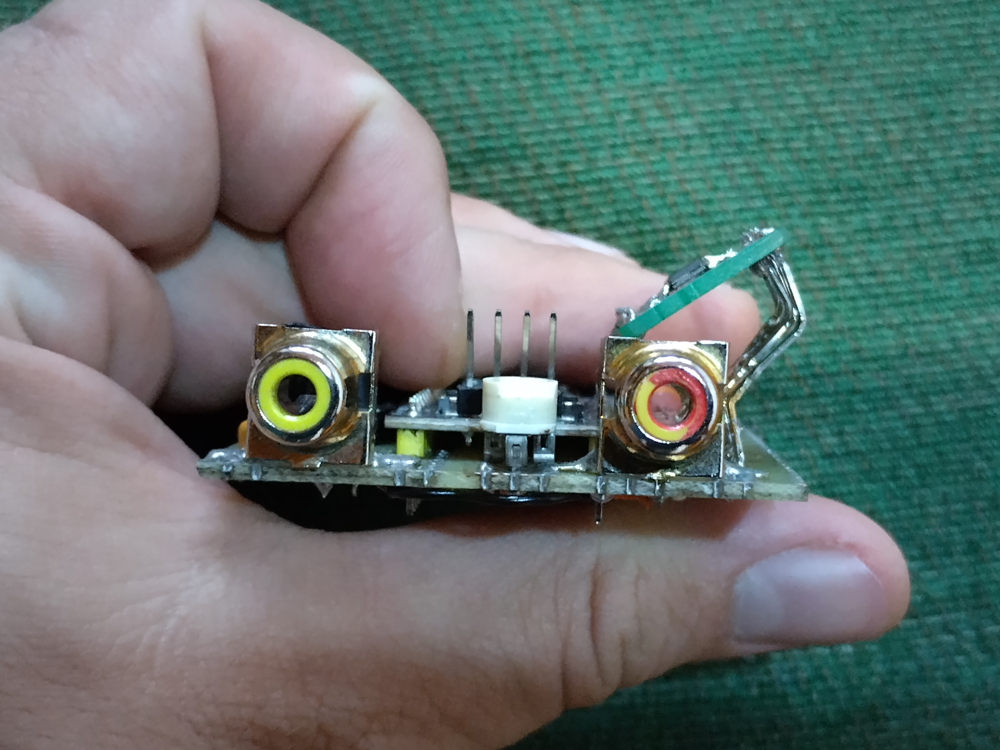
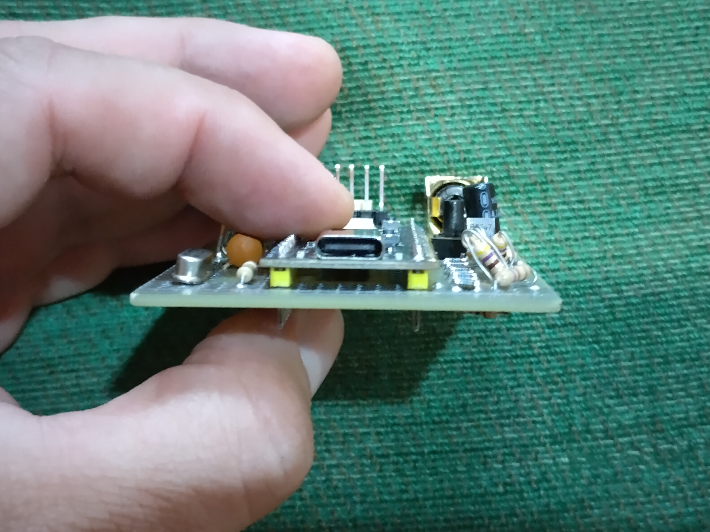
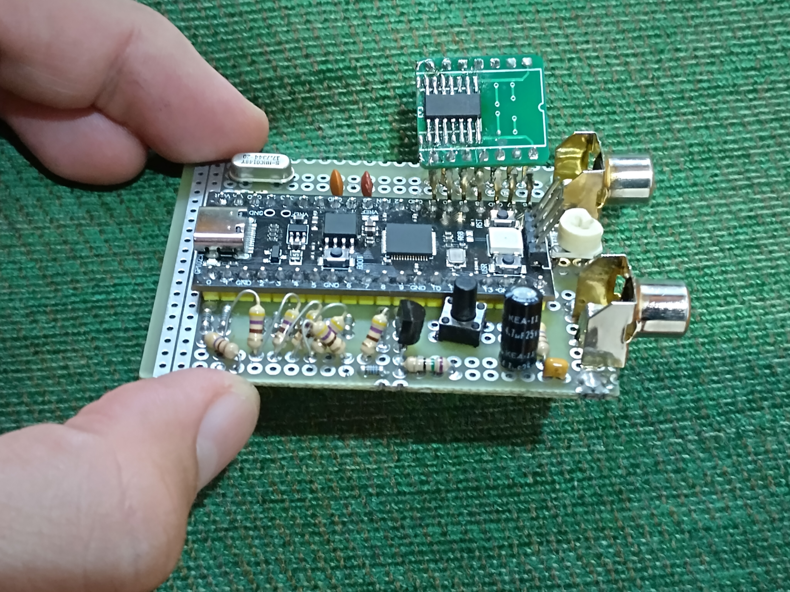

- Пълен PAL композитен видеосигнал: синхронизация, изравнителни импулси, цветен burst, V-switch (редуване на PAL фазата), презредово сканиране
- 8 тестови таблици, превключваеми в реално време с бутон
- Пикселна тактова честота, синхронизирана с кварц 17.734475 MHz (4 × fsc), така че цветоносната информация се генерира с точни фазови съотношения
- Нулево натоварване на CPU по време на извеждането на кадъра: PIO, три DMA канала и ISR извършват цялата работа
- Кръгово маскиране на централната област на шаблона (както при оригиналната PM5544), с контур против появата на празнини
- Синусоидален тестов тон от 1 kHz чрез PWM и DMA, с RC филтриране и потенциометър за регулиране на силата на звука
- LED индикатор за активност, който остава светнат, докато бутонът е натиснат (полезен за проверка на окабеляването)

## Тестови таблици

| № | Изображение | Таблица | Бележки |
|---|---|---|---|
| 0 | 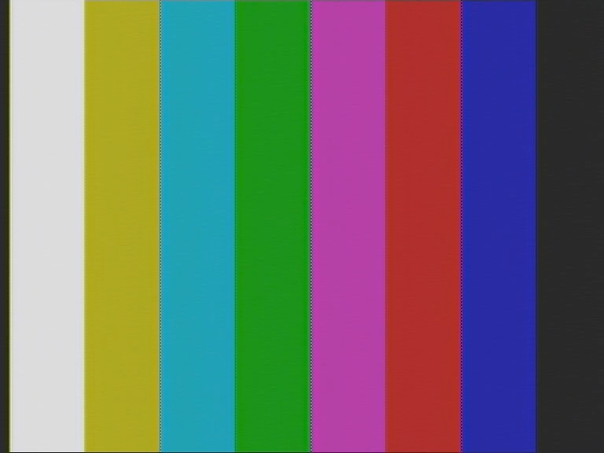 | EBU цветни ленти | 100% ленти с PAL burst |
| 1 | 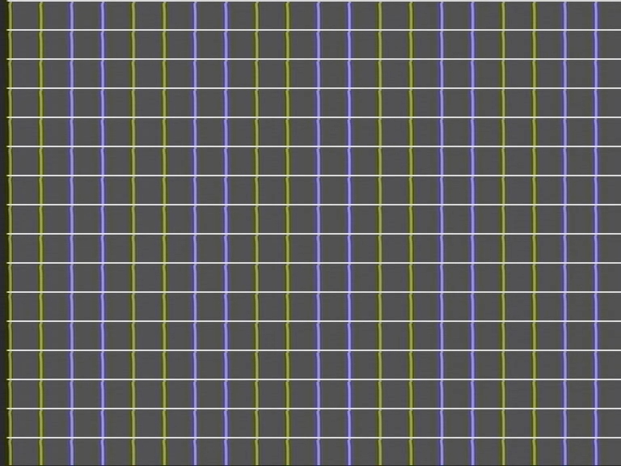 | Кръстосана мрежа | Бяла мрежа върху сив фон |
| 2 | 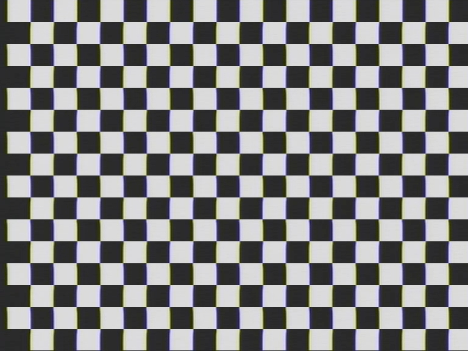 | Шахматна дъска | Черно-бели клетки с размер 47 px |
| 3 | 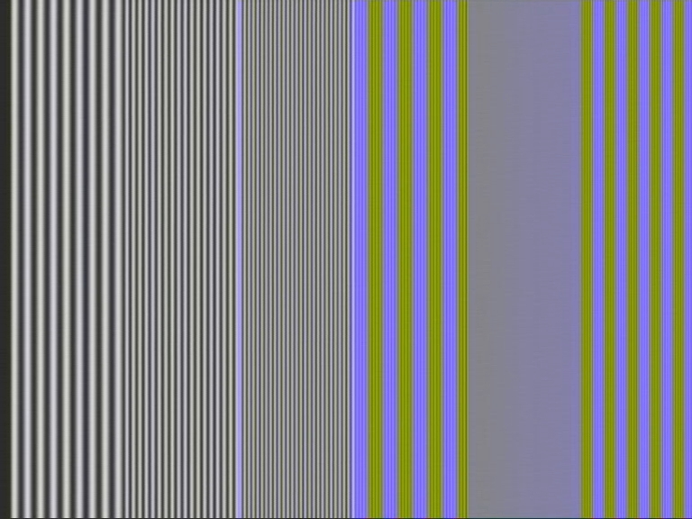 | Multiburst | Синусоидални импулси на 1.0, 2.0, 3.0, 4.0, 4.43 и 5.0 MHz |
| 4 | 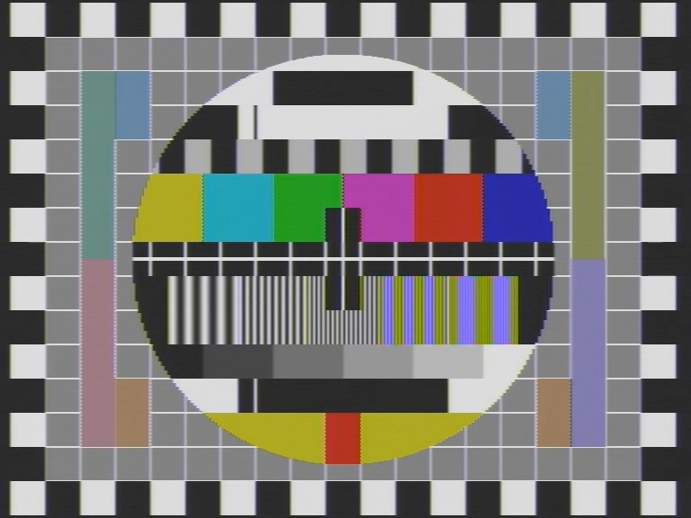 | **Philips PM5544** | Кръгова структура, проверки на НЧ/отражения, цветни ленти, решетки, градации на сивото, проверка на Y/C закъснението, цветни странични сигнали |
| 5 | 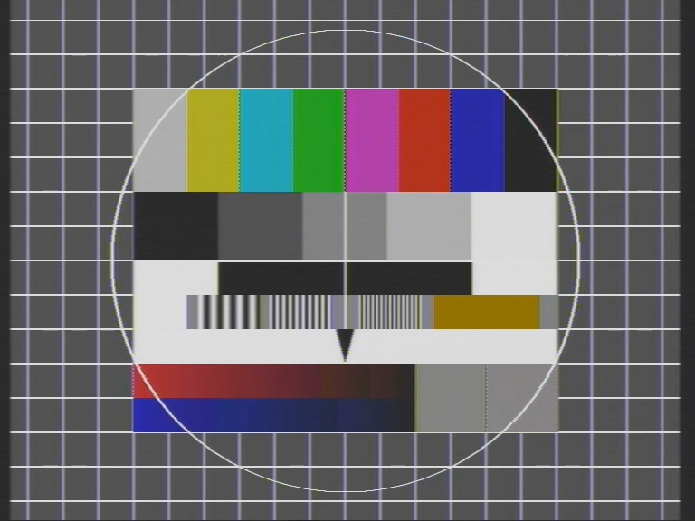 | **Telefunken FuBK** | Цветни ленти, градации на сивото, решетки, PAL тестови сектори, стесняващ се триъгълник |
| 6 | 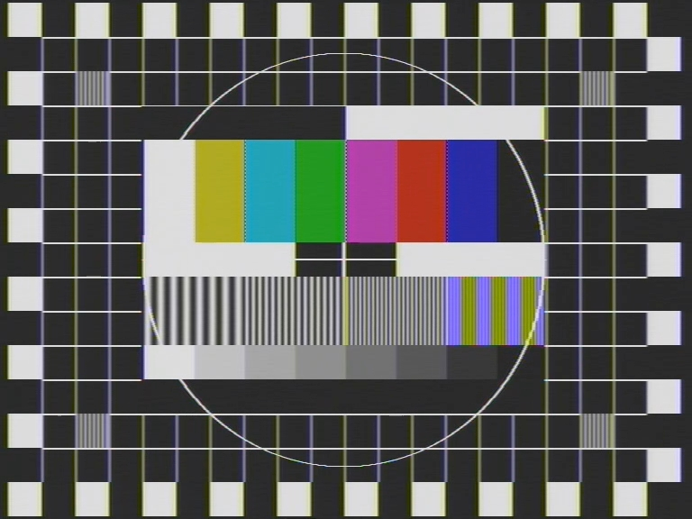 | **Grundig VG1001** (българска модификация, използвана от БНТ, „Нова телевизия“ и „7 дни ТВ“) | Назъбена рамка, централно поле с цветни ленти, решетки и градации на сивото |
| 7 | 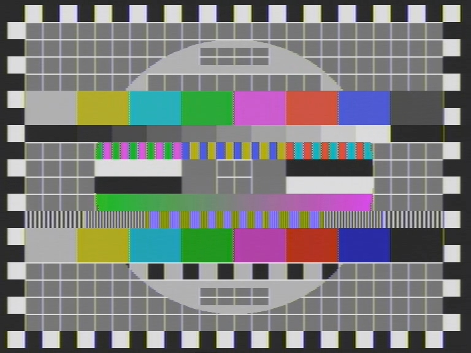 | **UEIT** | Решетка 26×20 клетки, цветни ленти, градации на сивото, ивици, наклонени/градиентни полета, решетки (понастоящем без кръгове в ъглите) |

Натиснете бутона, за да преминете към следващата таблица. След таблица 7 изборът се връща към таблица 0.

## Хардуер

### Електрическа схема

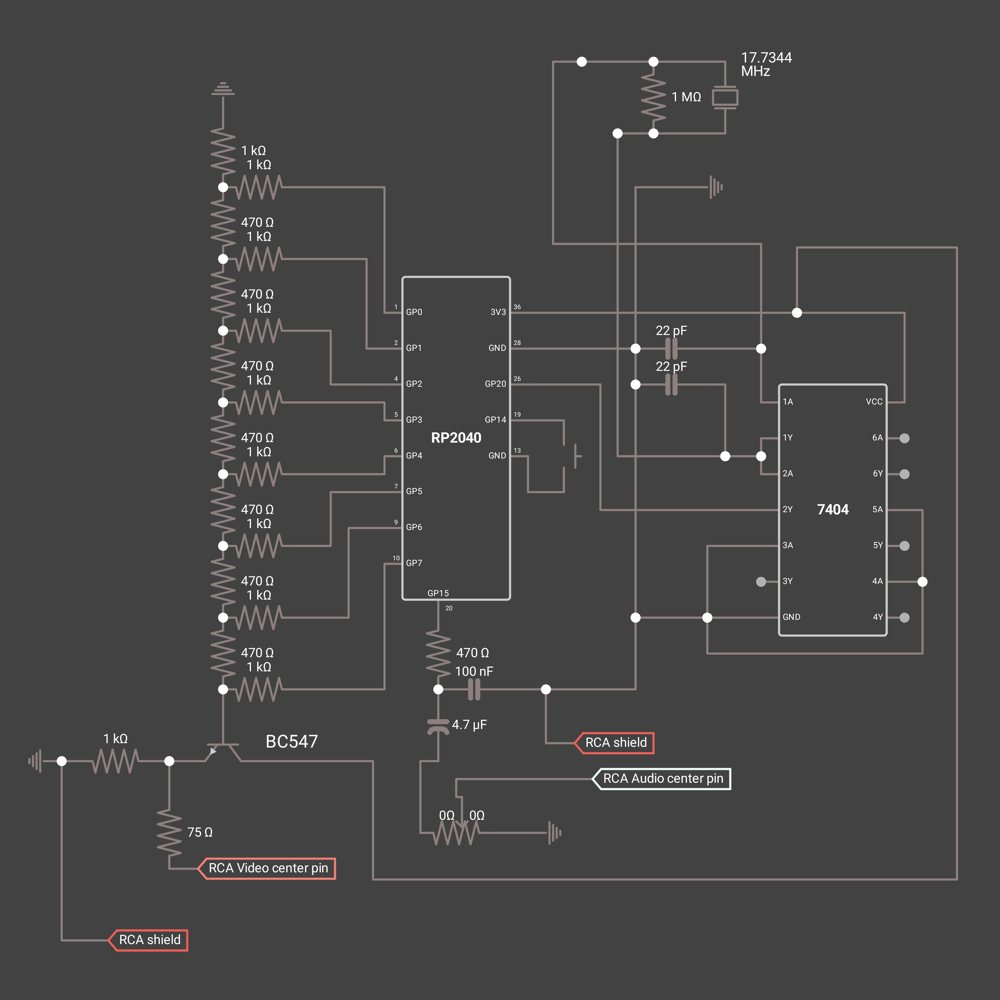

### Списък на компонентите

| Компонент | Стойност / тип | Предназначение |
|---|---|---|
| U1 | YD-RP2040 board | Микроконтролер (без овърклок, с външен тактов сигнал) |
| U2 | 74HCU04D шестканален инвертор | Кварцов осцилатор и буфер на тактовия сигнал |
| Y1 | 17.7344 MHz кварц | Пикселна тактова честота (4 × PAL подносеща, номинално 17.734475 MHz) |
| R | 1 MΩ | Обратна връзка на осцилатора |
| C | 2 × 22 pF | Кондензатори за товара на кварца |
| R-2R стълбица | 8 × 1 kΩ, 8 × 470 Ω, 1 × 1 kΩ termination | 8-битов видеосигнален ЦАП |
| Q1 | BC547 (NPN транзистор) | Емитерен повторител на изхода |
| R | 1 kΩ | Изтеглящ резистор към маса на емитера |
| R | 75 Ω | Последователен изходен резистор (импеданс на източника) |
| R | 470 Ω | Аудио нискочестотен филтър |
| C | 100 nF | Аудио нискочестотен филтър |
| C | 4.7 µF | Разделяне по постоянен ток в аудиосигнала |
| RV1 | Потенциометър (сила на звука) | Ниво на аудиосигнала |
| SW1 | Моментен бутон | Избор на таблица |
| J1, J2 | RCA конектори | Видео и аудио изходи |

### Разпределение на пиновете

| Пин на RP2040 | Функция |
|---|---|
| GP0–GP7 | 8-битов видеосигнален ЦАП (GP0 = LSB, GP7 = MSB) |
| GP14 | Бутон за избор на таблица (към GND, с вътрешен pull-up) |
| GP15 | PWM изход за аудиосигнала |
| GP20 | Вход за външен тактов сигнал (от осцилатора с 74HCU04) |
| GPIO25 | Вграден LED (индикатор за активност) |
| 3V3 / GND | Захранване за 74HCU04, колектора на BC547 и опорния сигнал на ЦАП |

### Тактов сигнал

Използват се два логически елемента на 74HCU04D. Първият (1A→1Y), заедно с резистора за обратна връзка 1 MΩ, кварца и двата кондензатора 22 pF, образува Pierce осцилатор. Нарочно се използва небуфериран (U-тип) инвертор, тъй като в тази роля той работи като линеен усилвател. Вторият логически елемент (2A→2Y) буферира изхода на осцилатора и го подава към GP20. Неизползваните входове на логическите елементи са фиксирани към определено логическо ниво.

След това RP2040 превключва **clk_sys** директно към този външен тактов сигнал (GPIN0 като допълнителен източник на `clk_sys`). Следователно системната тактова честота е точно 17.734475 MHz, с една PIO инструкция на пиксел, което съответства на 56.38 ns на семпъл.

### Видеосигнален ЦАП и изходен каскад

GP0–GP7 подават сигнала към резисторна стълбица от тип R-2R (1 kΩ за клоновете „2R“, 470 Ω за последователните елементи „R“ и 1 kΩ терминиращ резистор към маса). Изходът на стълбицата управлява базата на емитерен повторител с BC547. Колекторът е свързан към 3V3 (захранване с напрежение от 3.3 V, подавано от микроконтролера), а емитерът подава сигнала към резистор 1 kΩ към маса и последователен резистор 75 Ω към централния пин на RCA конектора, което осигурява импеданс на източника 75 Ω.

Нива на сигнала (8-битови кодове на ЦАП):

| Ниво | Код |
|---|---|
| Връх на синхроимпулса | 70 |
| Черно / гасене | 116 |
| Сиво | 170 |
| Бяло | 224 |

### Аудио

GP15 извежда PWM сигнал (wrap стойност 276, приблизително 64 kHz носеща честота). Чрез DMA през него се възпроизвежда синусоидална таблица с 64 стойности, което дава **тон с честота 1 kHz**. RC мрежа 470 Ω + 100 nF филтрира носещата честота. Кондензатор 4.7 µF блокира постоянната съставка, а потенциометър задава нивото на сигнала към централния пин на RCA конектора.

## Как работи

### Времедиаграма на видеосигнала

- 625 реда на кадър, 2:1 презредово сканиране, 576 видими реда
- 1136 семпъла на ред при 17.734475 MHz, което е приблизително 64.05 µs
- Последователността на редовете се повтаря на всеки 4 кадъра (2500 реда), което обхваща 8-полукадровата PAL цветова последователност
- 4 варианта на всеки линеен буфер (`s_mod = line % 4`) пренасят фазата на подносителя и състоянието на PAL V-switch

### Път на сигнала

```text
RAM line buffers ──▶ DMA compositor ──▶ ping/pong buffers ──▶ DMA ──▶ PIO ──▶ GP0–GP7 ──▶ R-2R DAC ──▶ BC547 ──▶ RCA
```

1. **PIO** (`video.pio`): програма с една инструкция `out pins, 8` с праг за автоматично извличане от 32 бита. Всяка 32-битова дума от FIFO се превръща в четири 8-битови пиксела — по един за всеки тактов импулс.
2. **Ping-pong DMA**: два свързани DMA канала подават 284 думи (1136 байта) на ред към TX FIFO на PIO. Всеки канал генерира прекъсване при приключване.
3. **ISR за композиция на реда** (`dma_isr` / `compose_line`): докато единият буфер се извежда, ISR изгражда следващия ред в другия буфер. Трети DMA канал копира реда от `base_table[]` (фон с пълна ширина) и `special_table[]` (вътрешен шаблон), използвайки маските за кръга за всеки ред `center_copy_dx[]` и `center_mask_dx[]`. Контурът на кръга се изчертава от CPU.
4. **Таблици на редовете**: `base_table[2500]` и `special_table[2500]` съдържат по един указател за всеки ред от 4-кадровата последователност. Всеки генератор на тестова таблица ги запълва.
5. **Аудио**: втора двойка DMA канали (за данни и управление) циклично подава синусоидалната таблица към PWM регистъра за сравнение без участие на CPU.

### Генериране на цветовете

PAL цветоносната информация се синтезира при 4 × fsc, така че всеки цикъл на подносителя обхваща точно 4 семпъла. U и V се добавят към яркостта според фазата на семпъла (`x % 4`), а V се инвертира на редуващи се линии. Цветният burst в `generate_hblank()` следва същата схема. Върху частите от шаблоните, съдържащи само яркост, се прилага 3-отводен FIR нискочестотен филтър (`apply_luma_lpf`). След това се добавят цветните ленти и решетките, за да останат резки.

### Памет

Всички линейни буфери са подравнени на 32 бита, така че DMA може да прехвърля по четири пиксела наведнъж. Те използват около 230 KB от наличните 264 KB SRAM на RP2040. Таблиците споделят буфери чрез `#define` алиаси (виж `ueit.c` и `vg1001_bnt.c`), така че всяка карта може да използва повторно буфери, които първоначално са именувани за PM5544.

## Структура на изходния код

| Файл | Описание |
|---|---|
| `main.c` | Настройка на хардуера, тактовата честота, конфигуриране на PIO и DMA, композитор на редовете, ISR, обработка на бутона |
| `video.pio` | PIO програма, която извежда 8-битови пиксели |
| `pm5544.c` | Шаблони за синхронизация/гасене, генериране на burst, споделени помощни функции (`fill_color_bar`, `apply_luma_lpf`, overlays) и генераторът на PM5544 |
| `fubk.c` | Карта Telefunken FuBK |
| `vg1001_bnt.c` | Карта Grundig VG1001 (българска модификация, използвана от БНТ, „Нова телевизия“ и „7 дни ТВ“) |
| `ueit.c` | Карта UEIT (Универсальная электронная испытательная таблица / УЭИТ), без кръговете в ъглите (реализирането им надхвърля хардуерните ограничения на платката) |
| `simple_patterns.c` | EBU цветни ленти, кръстосана мрежа, шахматна дъска, multiburst |
| `CMakeLists.txt` | Конфигурация за компилиране с Pico SDK |

Изходните файлове на картите се `#include`-ват в `main.c`, така че целият проект представлява една преводна единица.

## Компилация

Изисквания: Raspberry Pi Pico SDK (със зададен `PICO_SDK_PATH`), CMake ≥ 3.13 и ARM GCC toolchain.

```bash
git clone https://github.com/AleSla/Pico-PAL-Test-Card-Generator.git
cd Pico-PAL-Test-Card-Generator
mkdir build && cd build
cmake ..
make -j
```

Компилацията създава `pico_pal_generator.uf2`.

## Флашване

1. Задръжте **BOOT** на YD-RP2040 и свържете USB (или натиснете RESET, докато държите BOOT).
2. Копирайте `pico_pal_generator.uf2` към появилото се устройство `RPI-RP2`.

> **Платката се нуждае от външния тактов сигнал, за да работи.** Фърмуерът превключва `clk_sys` към GP20 малко след стартиране. Ако осцилаторът 17.7344 MHz не работи, платката ще спре. Флашвайте я при свързан осцилатор или задръжте BOOT при включване на захранването.

## Използване

1. Свържете видео RCA конектора към PAL монитор, телевизор или устройство за захващане на видео (вход 75 Ω).
2. Захранете платката през USB.
3. Натиснете бутона на GP14, за да преминавате през тестовите таблици.
4. По желание свържете аудио RCA конектора за тона от 1 kHz.

## Известни проблеми и бележки

- Декодирането на цветовете може да се различава при различни вериги за захващане и визуализация заради цифровия синтез на подносителя и опростения изходен каскад.
- Поведението при възпроизвеждане на цветовете трябва да се провери със собствения ви декодер и карта за захващане.

## Персонализиране

- **Нива**: `SYNC_TIP`, `BLACK_LEVEL`, `GRAY_LEVEL`, `WHITE_LEVEL` в началото на `main.c`
- **Честота на тона**: променете PWM wrap стойността или дължината на `audio_lut`
- **Нови карти**: добавете функция `build_xxx()`, която запълва буферите и двете таблици на редовете, след което я добавете към обработчика на бутона в `main()`

## Благодарности

- Тестовите карти Philips PM5544, Telefunken FuBK, Grundig VG1001 и UEIT са дело на техните оригинални дизайнери. Този проект представлява независимо хоби възпроизвеждане с цел тестване на оборудване.

## Лиценз

Лицензиран съгласно лиценза GPL-3.0.
